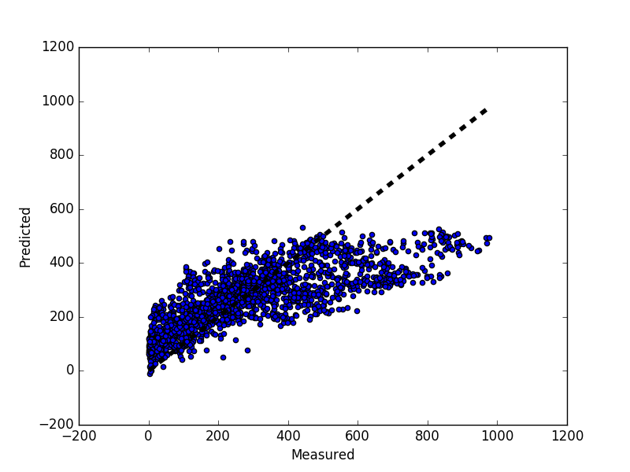

# [Kaggle bike sharing demand](https://www.kaggle.com/c/bike-sharing-demand)

## Part 1 - Exploratory data analysis

First, let's refactor the `datetime` feature. We can't analyse non numerical values. We transform it ("yyyy/mm/dd") to `date`, `hours`, `dayOfYear` and `year`.

The main data exploratory analysis tool is the scatter matrix of each feature against another. Since we are trying to predict the `count` feature, we look at its relations with other features.

- The most evident features related to `count` are `hour` and `weather`.
- Least significant linked features related to `count` are `workingday`, `dayOfYear` and `holiday`.
- The `count` variable seems to follow a decreasing exponential equation. Linear regression is probably not a good model.

It seems like casual and registered users rent bike follow different models.

## Part 2 – Machine Learning
### Feature engineering
#### Categorical variables
Some of the provided features are categorical features : `weekDay`, `season` and `weather`. We are going to transform each categorical feature with m possible values into m binary features, with only one active.

#### Refactoring `datetime`
`datetime` is a string. This is a problem because strings can't be processed mathematically. I transformed the string into a date and then transformed it to `hour`, `dayOfYear`, `weekDay` and `year`. I added `year`, and it improved performance a lot.

The `hour` feature was a more challenging problem. It can be considered a categorical feature by itself. There is few rental at 1, 2, 3 am and 22, 23 => the relation between the hour and the number of rental is not linear. First I split the `hour` feature into 24 sub-categories. It worsened performance, probably because of overfitting. So I decided to cluster hours. For this I took the most simple clustering algorithm : k-mean. Empirically, I found that clustering `hour` in 12 chunks (of 2 hours), lead to the best performance. I then create one feature for each cluster. It significantly improved performance.

#### `casual` vs `registered`
I pinpoint in part 1 that casual and registered users follow different trends. Rather than trying to predict the number of rental directly, I tried predicting the number of casual rental, the number of registered rental and summing them up. Improved performance a bit (+100 places on the kaggle ladder).

### Model explanation
I benchmarked two models : one using linear regression and one using random forest. Random forest are, by design, at least as good as linear regression at the cost of more time for fitting. Since the count variable isn't linear, linear regression performs poorly. Random forest is way better :

*linear regression results*

*random forest results*

Since the size of data is small, computational time is insignificant. I have chosen random forest.

### Performance criterions
#### Root Mean Squared Error (rmse)
This is a frequently used measure of the differences between values (sample and population values) predicted by a model and the values actually observed.

#### R squared
This an improved version of the rmse. This is rmse corrected by the variance of the value to predict. It corrects rmse, to catch only the part of the difference between the predicted value and the result caused by the the model (and not the variation of the result).

### Improvement ideas
- cross validation : I tested my models by splitting my data into a train and test set . To improve that metrics, it is better to implement a cross validation.
- test more algorithms : I only tested random forest and linear regression. Maybe other algorithm perform better (neural networks...).

## Conclusion

I ended up with a reasonably good model (I was ranked 749 out 3252). Since this was my first real world machine learning project, it was a lot of fun and I learned a lot at every level (first time implementing R2, rmse, using random forest, doing real feature engineering...).
